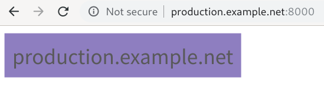
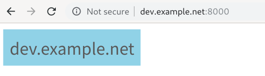
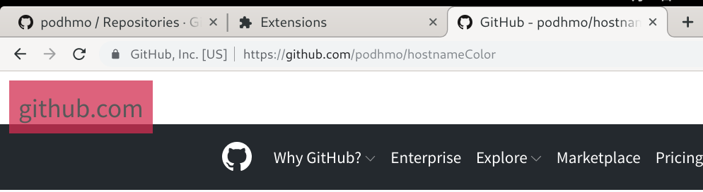
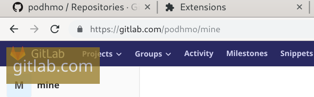

# hostnameColor

With color based on the given url's hostname.

## install

Sorry, this extension is not published yet. So, install as development version.

- [chrome tutorial](https://developer.chrome.com/extensions/getstarted#manifest)
- [firefox tutorial](https://developer.mozilla.org/ja/docs/Mozilla/Add-ons/WebExtensions/Your_first_WebExtension#Trying_it_out)

## usecases

### 0. on web application development

On development, we are accessing several (or many) URLs, for same application.

For example, `production-<app name>.net`, `dev-<app name>.net` , ... and so on. many environments are existed for same application.

- production env
- staging env
- master env
- development env
- <topic branch0> env
- <topic branch1> env
- ...

Then, accessing each environement's URL with this extension.

production.example.net

dev.example.net

.. and so on.

## screenshots

on https://github.com

on https://gitlab.com

## enable/disable

Please click extension's icon, the state is toggled.

 
